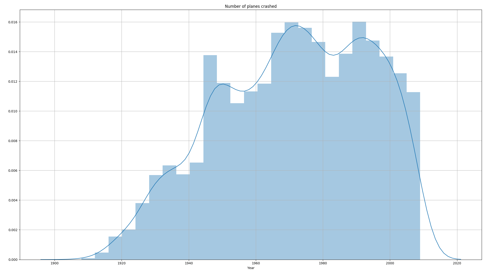
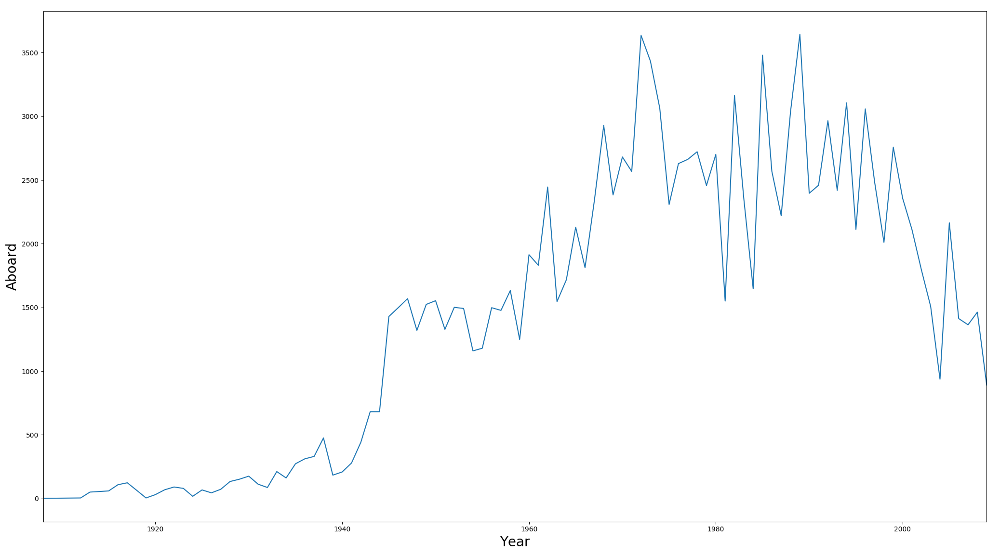
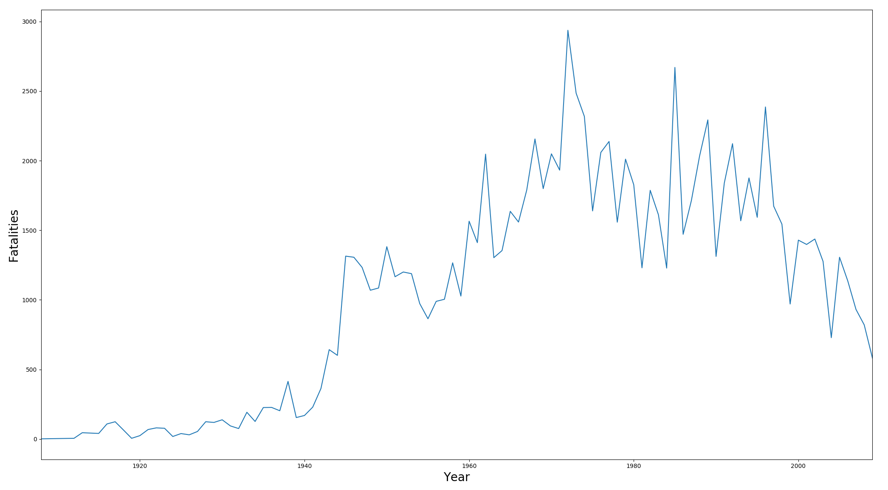
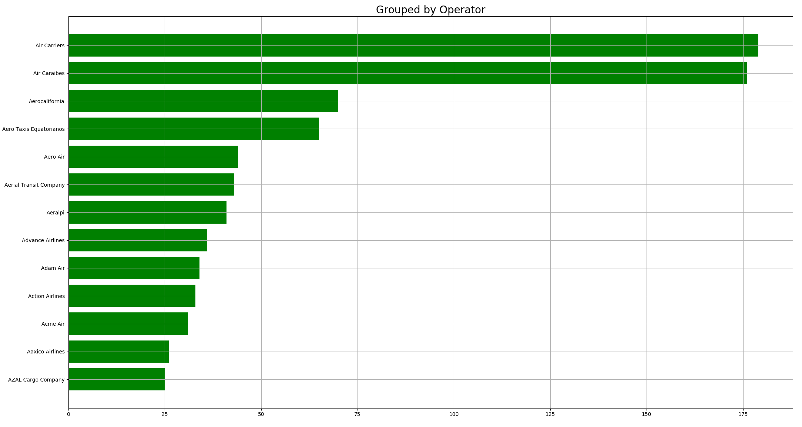
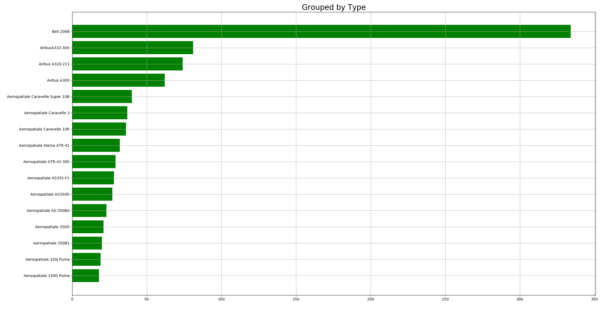
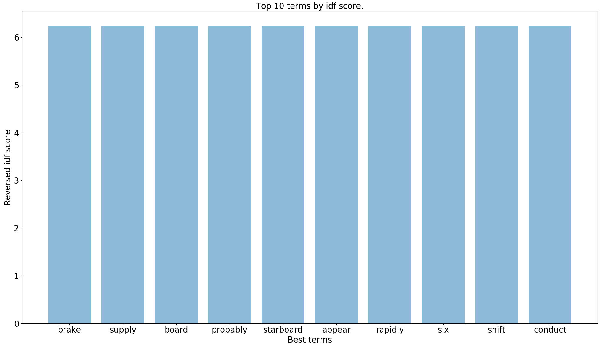
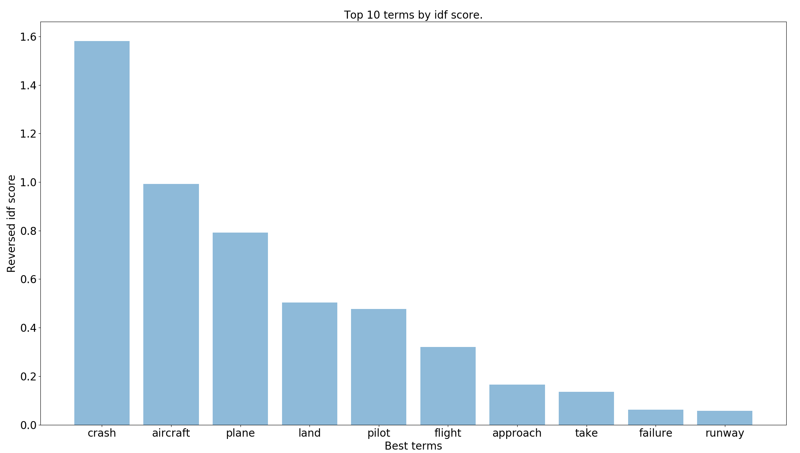
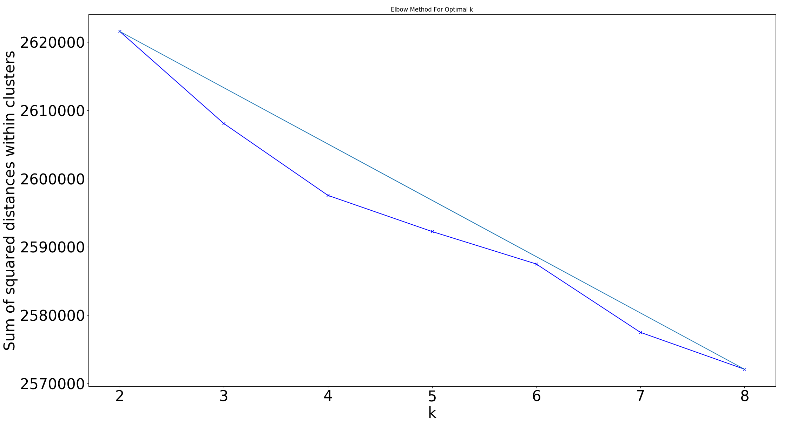
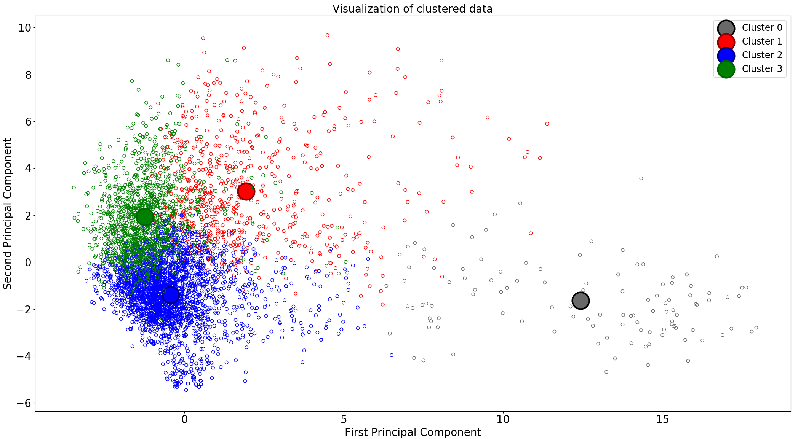
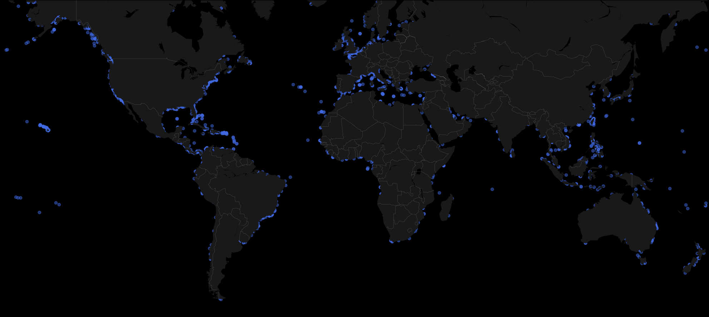

## Inspection of The Airplane Crashes Dataset

### Overview
In this project we are interested in analysis of airplane crashes since 1908. Each row represents a record of a plane crash.
Through various data analysis methodology especially clustering, we try to find some meaningful insights in the data.

### Installation
_Note: Required Python 3+_;

First of all you need to install and create python virtual environment (venv).
```shell script
$ python3 -m venv <name-of-venv>
```

After that, activate venv.
```shell script
$ source venv/bin activate
```

Install all required packages.
```shell script
$ pip install -r requirements.txt
```

Install sent2vec introduced in the [paper](https://arxiv.org/pdf/1703.02507.pdf).
```shell script
$ git clone https://github.com/epfml/sent2vec.git
$ cd sent2vec
$ make
$ pip install .
```

### Data Cleaning
The purpose of this part is to get know the data, preprocess and save them as a new csv file.
Print some records to get some sense about the dataset, by:
```python
pd.set_option('display.max_columns', 20)
pd.set_option('display.width', 1000)

df = pd.read_csv(config.DATASET_DIR + args.input_airplane_crashes_file, encoding='utf-8')

print(df.head())
```
.. and we get
```shell script
         Date   Time                            Location                Operator Flight #          Route                    Type Registration cn/In  Aboard  Fatalities  Ground                                            Summary
0  09/17/1908  17:18                 Fort Myer, Virginia    Military - U.S. Army      NaN  Demonstration        Wright Flyer III          NaN     1     2.0         1.0     0.0  During a demonstration flight, a U.S. Army fly...
1  07/12/1912  06:30             AtlantiCity, New Jersey    Military - U.S. Navy      NaN    Test flight               Dirigible          NaN   NaN     5.0         5.0     0.0  First U.S. dirigible Akron exploded just offsh...
2  08/06/1913    NaN  Victoria, British Columbia, Canada                 Private        -            NaN        Curtiss seaplane          NaN   NaN     1.0         1.0     0.0  The first fatal airplane accident in Canada oc...
3  09/09/1913  18:30                  Over the North Sea  Military - German Navy      NaN            NaN  Zeppelin L-1 (airship)          NaN   NaN    20.0        14.0     0.0  The airship flew into a thunderstorm and encou...
4  10/17/1913  10:30          Near Johannisthal, Germany  Military - German Navy      NaN            NaN  Zeppelin L-2 (airship)          NaN   NaN    30.0        30.0     0.0  Hydrogen gas which was being vented was sucked...
```

Print some more info, like shape and sum of missing values per columns:
```python
print(df.shape)
print(df.isnull().sum())
```
The dataset consist of 13 columns and #### of rows. There are some columns which got quite a lot of missing values.
Columns that exceed the allowed threshold (let's say 0.35) will be deleted:
```python
threshold = .35
	number_of_samples = df.shape[0]
	for column in df.columns:
		if df[column].isnull().sum() / number_of_samples > threshold:
			df.drop(column, 1, inplace=True)
```

For further simplified analysis we split the Date column into two new ones -- MonthDay and Year.
```python
df['Year'] = df['Date'].apply(lambda x: x[6:])
df['Date'] = df['Date'].apply(lambda x: x[:5])
df = df.rename(columns={'Date': 'MonthDay'})
```

```shell script
MonthDay  Year                            Location                Operator          Route                    Type Registration  Aboard  Fatalities  Ground                                            Summary
0    09/17  1908                 Fort Myer, Virginia    Military - U.S. Army  Demonstration        Wright Flyer III          NaN     2.0         1.0     0.0  During a demonstration flight, a U.S. Army fly...
1    07/12  1912             AtlantiCity, New Jersey    Military - U.S. Navy    Test flight               Dirigible          NaN     5.0         5.0     0.0  First U.S. dirigible Akron exploded just offsh...
2    08/06  1913  Victoria, British Columbia, Canada                 Private            NaN        Curtiss seaplane          NaN     1.0         1.0     0.0  The first fatal airplane accident in Canada oc...
3    09/09  1913                  Over the North Sea  Military - German Navy            NaN  Zeppelin L-1 (airship)          NaN    20.0        14.0     0.0  The airship flew into a thunderstorm and encou...
4    10/17  1913          Near Johannisthal, Germany  Military - German Navy            NaN  Zeppelin L-2 (airship)          NaN    30.0        30.0     0.0  Hydrogen gas which was being vented was sucked...
```

We will put special attention on the Summary column in the next steps. 


### Explonatory Analysis



Img. 1 Aboard per Year      |  Img. 2 Fatalities per Year
:-------------------------:|:-------------------------:
 |  


Img. 1 Highest IDF Score      |  Img. 2 Lowest IDF Score
:-------------------------:|:-------------------------:
 | 


### Text Clustering of Summaries


#### Text Preprocessing
<!-- In this part we are interested in the .. -->

The raw text of the column 'Summary' is not suitable for nlp analysis therefore
 we have to do transformation to more convenient way for further processing
  need by several functions which are defined below: 

```python
def _remove_whitespace(summary):
	return ' '.join(summary.split())
```


```python
def _to_lowercase(summary):
	return summary.lower()
```


```python
def _remove_punctuation (summary, regex=r'[!"#$%&\'()*+,./:;<=>?@[\]^`{|}~]'):
	return re.sub(regex, '', summary)
```


```python
def _remove_numbers (summary):
	return re.sub(r'\d+', '', summary)
```


```python
def _tokenize(summary):
	return nltk.tokenize.word_tokenize(summary)
```

```python
def _remove_stopwords(tokenized_summary):
	stop_words = set(nltk.corpus.stopwords.words("english"))
	filtered_summary = [word for word in tokenized_summary if word not in stop_words]

	return filtered_summary
```


```python
def _lemmatize_word(tokenized_summary):
    lemmatizer = nltk.stem.WordNetLemmatizer()
	lemmas = [lemmatizer.lemmatize(word, pos='v') for word in tokenized_summary]

	return lemmas
```

Now we can encapsulate all these functions into the only one


#### Text as Features


##### Tf-Idf Vectorizer


<!-- Img. 1 Highest IDF Score      |  Img. 2 Lowest IDF Score
:-------------------------:|:-------------------------:
 |  -->

#### K-Means

```python
df = pd.read_csv(config.DATASET_DIR + args.dataset, encoding='utf-8')
summaries = df['Summary'].dropna()
```


**Final pipeline:**
```python
pipeline = Pipeline(
		('tf_idf_preprocess_summaries', FunctionTransformer(preprocessing.tf_idf_summaries_preprocessing, validate=False)),
		('tf_idf_vectorizer', TfidfVectorizer(stop_words=None, ngram_range=(1, 2), max_df=args.max_df, min_df=args.min_df)),
		('scaler', StandardScaler(with_mean=False)),
		('kmeans', KMeans(
				n_clusters=args.n_clusters,
				verbose=0,
				n_init=30,
				max_iter=1000,
				random_state=43,
				n_jobs=-1
			)
	),
	, verbose=True)
```
Thanks to function _sklearn.preprocessing.FunctionTransformer_ we can apply our custom text preprocessing step in a global pipeline.
Option _with_mean_ is because of sparse nature of the data.


**Extracting the meaning of each of four clusters:**

```python
centroids = kmeans.cluster_centers_

labels_counter = Counter(labels)
for cluster_number in range(args.n_clusters):
	print("Cluster {} contains {} samples".format(cluster_number, labels_counter[cluster_number]))
	most_important = centroids[cluster_number, :].argsort()
	for i in range(args.n_best_terms):
		term_index = most_important[-(i)]
		print(' %s' % terms[term_index], sep='_', end='\t')
		print()
```


**Cluster 0** contains 114 samples  
able, vfr flight, flight adverse, continue vfr, adverse weather, adverse, vfr, continue, weather condition, condition

**Cluster 1** contains 673 samples  
cabin, pilot, instrument, contribute, altitude, factor, maintain, approach, minimum, terrain

**Cluster 2** contains 2937 samples  
flight adverse, crash, plane, aircraft, land, mountain, take, route, en route, en

**Cluster 3** contains 1154 samples  
disappear en, aircraft, control, loss, engine, leave, right, wing, result, cause


```python
pca = PCA(n_components=args.n_components)
transformed_summaries = pca.fit_transform(transformed_summaries.toarray())
centroids = pca.transform(centroids)
```

After that we can call a responsible for plotting the transformed data into 2 dimensions also with centroids
`utils.plot_2d_data_with_clusters(data=transformed_summaries, labels=labels, clusters=centroids)` and we get:


<!--  -->



#### Basemap

**Get long lat from location**
```python
def get_coor (df_item):
	ix, loc = df_item
	sleep(np.random.randint(1, 3))
	try:
		location = geolocator.geocode(loc)
		if location is not None:
			lat, long = (location.latitude, location.longitude)
			print(str(ix) + ';' + str(loc) + ';' + str(lat) + ';' + str(long))
			utils.write_file(str(ix) + ';' + str(loc) + ';' + str(lat) + ';' + str(long) + '\n', out_filename='coordinates.txt')
		else:
			utils.write_file(str(ix) + ';' + str(loc) + '\n', out_filename='coordinates-wrong-query.txt')

	except (GeocoderUnavailable, GeocoderQuotaExceeded, GeocoderTimedOut) as e:
		print(e)
		utils.write_file(str(ix) + ';' + str(loc) + '\n', out_filename='coordinates.txt')
```

**Plot coordinates on the map**



<!--## TODO-->
<!--- GMM-->
<!--- LDA-->


